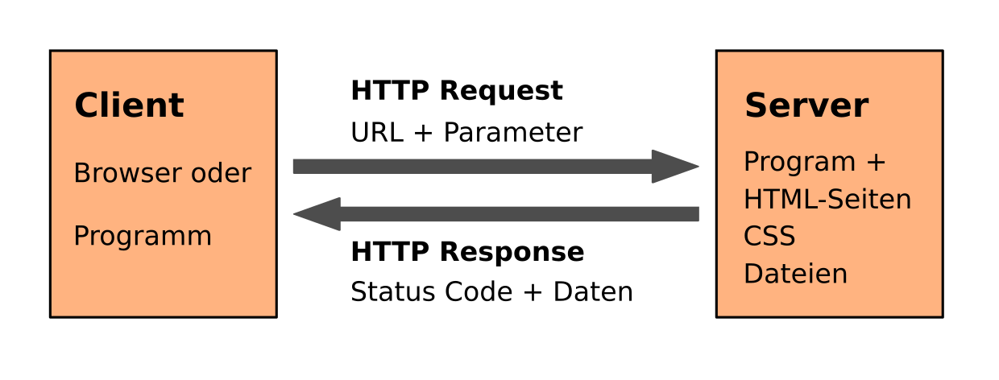

APIs automatisieren
===================

.. card::
   :shadow: lg

   **Einstiegsfragen**

   * Was ist eine REST API?
   * Was sind Vorteile von APIs gegenüber HTML-Webseiten?
   * Was für Einsatzgebiete haben APIs?

Wie funktionieren API-Aufrufe?
------------------------------

BILD: HTTP REQUEST -> API -> JSON -> RETURN CODE

APIs bieten einen bequemen Einstieg in die Abfrage von Web-Ressourcen.
Wie normale Webseiten erfolgt die Interaktion meist über das HTTP-Protokoll.
Das Format **JSON** hat sich als Standard für die Rückgaben etabliert.
Da kein HTML-Code gelesen werden muß, sind die Ergebnisse meist leicht maschinell zu verarbeiten.

Jeder HTTP-Request liefert einen Statuscode zurück. Die häufigsten sind:

========== ================================================
Statuscode Beschreibung
========== ================================================
200        alles OK
400        falsches Format der Anfrage
401        fehlende Authentifizierung
403        fehlende Rechte des authentifizierten Benutzers
404        nicht existierende URL
405        falsche Methode (z.B. GET statt POST)
500        schwerwiegender serverseitiger Fehler
========== ================================================

Es gibt zwei Arten von Requests zu unterscheiden:

HTTP GET
++++++++

Sämtliche Parameter der Anfrage müssen als URL-Parameter kodiert werden.
GET hat den Vorteil, dass die URLs leicht zu lesen (und zu debuggen sind).
Es gibt jedoch eine Längenbegrenzung für die URL (etwa 2 KB).

HTTP POST
+++++++++

Bei POST-Requests werden Parameter als gesondertes Datenpaket verschickt.
Mit POST lassen sich auch große Dateien verschicken.
Außerdem ist aus der URL nicht sofort ersichtlich, was geschickt wird.
Daher ist POST für größere Formulare beliebt.

Erstellen von API-Anfragen
--------------------------

Die Python-Bibliothek ``requests`` erstellt HTTP-requests.
Sie eignet sich sowohl für API-Anfragen als auch für HTML-Webseiten.
Sowohl GET als auch POST requests lassen sich erstellen.
Auch eine Cookie-Verwaltung ist möglich. 
``requests`` ist dem Module ``urllib`` aus der Standardbibliothek weit überlegen.
Es ist der de-facto Standard für HTTP-Requests in Python.
Damit ist ``requests`` eine der beliebtesten Python-Bibliotheken überhaupt.

``requests`` muß zunächst installiert werden:

.. code::

   pip install requests

Das Abfragen eines **API Endpoints** erfordert nur wenige Zeilen.
Hier ist eine Anfrage an die `Star Wars API <https://swapi.dev/documentation>`__ :

.. literalinclude:: example_api_request.py

.. card::
   :shadow: lg

   **Übung**

   Führe den Code aus.
   Wähle einen anderen Endpoint aus der `Star Wars API Dokumentation <https://swapi.dev/documentation>`__ und stelle den Code um.

----

URL Parameter
-------------

Viele Webseiten und APIs erwarten mehr als einen Parameter.
In diesem Fall kann es eleganter sein, diese als Dictionary and ``requests`` zu übergeben:

.. literalinclude:: search_with_parameters.py

.. seealso::

   Beispiel für das Auslesen einer komplexeren API: Fahrplan der :download:`Berliner Verkehrsbetriebe <bvg.py>`

----

Blockieren vermeiden
--------------------

Viele APIs, insbesondere öffentliche, haben Nutzungsbeschränkungen.
Dies können sich beziehen auf:

* die Anzahl Anfragen pro Zeiteinheit
* den Zeitraum zwischen den Anfragen

Viele Server sperren den Zugang bei Überschreitung dieser Schranken,
um ihre eigene Kapazität zu steuern und DDoS-Angriffe abzuwehren.
Die genauen Konditionen sind normalerweise dokumentiert.
Es gehört zum guten Ton, sich vorher die Nutzungsempfehlungen oder die Datei ``robots.txt`` durchzulesen.

.. seealso::

   `www.scrapehero.com/how-to-prevent-getting-blacklisted-while-scraping/ <https://www.scrapehero.com/how-to-prevent-getting-blacklisted-while-scraping/>`__

----

API-Schlüssel verwenden
-----------------------

Manche Services erfordern eine Authentifizierung.
Wie das genau funktioniert hängt von der angesprochenen API ab.
Die meisten Verfahren basieren auf **asymmetrischer Verschlüsselung**.

* wird nur Lese-Zugriff benötigt, muß ein **Token** als Parameter mitgeliefert werden.
* für Lese- und Schreibzugriff wird ein **Schlüsselpaar** (Token+Secret) benötigt.
* manchmal ist für die Authentifizierung ein gesondertes request ähnlich einem Login nötig.

Verbreitete Verfahren sind z.B. OAuth und Kerberos.
Ein gut dokumentiertes Übungsbeispiel ist die Google API, mit der sich beispielsweise
`Google Spreadsheets <https://developers.google.com/sheets/>`__ fernsteuern lassen.

.. warning::

   Tokens und Schlüssel sollten niemals im Quelltext stehen.
   Verwende Umgebungsvariablen oder eine Datei um die Schlüssel zu speichern.

----

Beispiel: Star-Wars-Tabelle
---------------------------

Verwende den Endpoint ``planets/`` der Star Wars API, indem Du als ``id`` eine Zahl einsetzt:

.. code::
   
   https://swapi.dev/api/planets/{id}/?format=json

Sammle Daten, um eine Tabelle mit Name, Klima und Bevölkerung von 5 Planeten aus Star Wars zu befüllen und speichere sie ab.

----

Links
-----

* `Dokumentation von requests <http://docs.python-requests.org/en/latest/index.html>`__
* Das Python-Modul `logging <https://docs.python.org/3/library/logging.html>`__ 
* Einführung in `asynchrone requests <https://realpython.com/python-async-features/>`__
* eigene APIs mit `FastAPI <https://fastapi.tiangolo.com/>`__ starten
