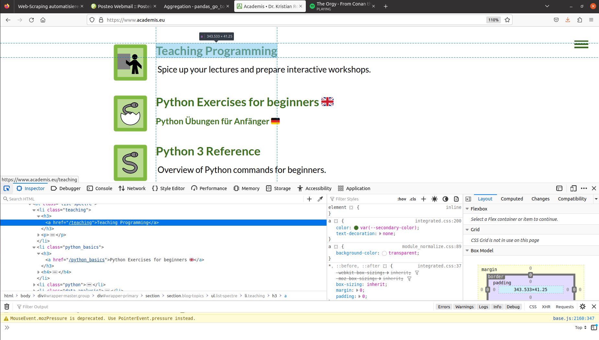

Web-Scraping automatisieren
===========================

Was ist Web Scraping?
---------------------

Beim Web Scraping geht es darum, Inhalte aus HTML-Webseiten zu sammeln.
Im Gegensatz zu APIs erhält man die Daten nicht in einer vorstrukturierten Form, sondern muß sie auf oftmals etwas mühselige Weise aus dem HTML-Code *"herauskratzen"*.
Wichtige Anwendungsfälle für Web Scraping sind:

- es keine API gibt
- die Seitenbetreiber eigentlich nicht möchten, daß Daten von der Seite gesammelt werden
- der Inhalt der Webseite für eine Suchmaschine indiziert werden soll
- der Inhalt der Webseite ausführlich getestet werden soll

.. warning::

   Beim Web Scraping ist es recht leicht, sich in eine rechtliche Grauzone zu begeben.
   Ist man auf fremden Servern unterwegs, sollte man unbedingt die Datei ``robots.txt`` der Seite und eventuelle Nutzungsbedingungen auf der Seite beachten.

----

Erstellen einer HTTP-Anfrage
----------------------------

Eine HTML-Seite läßt sich genauso wie eine API mit der Bibliothek ``requests`` einlesen.
Hier ist ein einfaches Beispiel mit der Homepage des Autors:

.. literalinclude:: example_requests.py

Das Attribut ``page.text`` enthält den HTML-Code der Seite als String.

----

Anfragen als Browser tarnen
---------------------------

Manche Webseiten möchten gerne wissen, welcher Browser eine Seite anfordert und weisen eine "nackte" HTTP-Anfrage ab.
Es ist recht leicht, ``requests`` als Browser zu tarnen:

.. code:: python3

   headers = {'User-Agent': 'Mozilla/5.0 (Macintosh; Intel Mac OS X 10_10_1) AppleWebKit/537.36 (KHTML, like Gecko) Chrome/39.0.2171.95 Safari/537.36'}
   page = requests.get(url, headers=headers)

.. note::

   Da die Browserabfrage keine ernsthafte Sicherungsmaßnahme ist, handelt es sich hierbei nach Meinung des Autors nicht um einen Einbruchsversuch.
   Es ist eher mit der Aufforderung vergleichbar, sich vor dem Eintreten eine Krawatte oder ein Halstuch umzubinden.

----

Erforschen der HTML-Struktur
----------------------------

Bevor die Inhalte ausgelesen werden, muß man herausfinden, wonach man eigentlich sucht.
Dazu muß der HTML-Code inspiziert werden.
Dazu empfehlen sich die Web-Entwicklertools, die jeder Browser mitbringt.
Suche nach einem Menüpunkt **Inspect**, **Web Development Tools** o.ä.:

In dieser Etappe lohnt es sich nach Kennzeichen Ausschau zu halten, die die gesuchten Inhalte eindeutig identifizieren.
Häufig sind das:

* das ``id``-Attribut
* CSS-Klassen
* ``
``-Tags

----

Parsen der HTML-Struktur
------------------------

Jedes HTML-Dokument ist in einer Baumstruktur organisiert, dem sogenannten **DOM-Objekt**.
Es gibt zahlreiche Bibliotheken, um nach Elementen in dieser Baumstruktur zu suchen.
Jedes gefundene Element ist dabei ein Unterbaum, der weitere Elemente enthalten kann.
Der Code wird dadurch schnell verschachtelt.

Die Python-Bibliothek der Wahl zum Parsen von HTML ist **BeautifulSoup**.
Sie läßt sich installieren mit:

.. code::

   pip install beautifulsoup4

Beginnen wir mit einem Anwendungsbeispiel:

.. card::
   :shadow: lg

   **Übung:**

   Führe den Code aus und bespreche die Fragen darunter.

   .. literalinclude:: ex_bs4.py

   -  what is the data type of the HTML document?
   -  what does the ``find_all()`` function return?
   -  what does the argument of the ``find_all()`` function refer to?
   -  what does the argument of the ``get()`` function refer to?
   -  what does the ``get_text()`` function extract?
   -  how would you extract the title of the play?

Um eine HTML-Seite in eine Baumstruktur einzulesen, benötigt man das Attribut ``.text`` der Seite:

.. code:: python3

   from bs4 import BeautifulSoup
   import requests

   page = requests.get(url)
   soup = BeautifulSoup(page.text)

Aus dem Objekt ``soup`` lassen sich nun die enthaltenen Elemente suchen und deren Inhalte abgreifen, egal wie tief sie verborgen sind.
Die Methoden dazu sind:

- ``.find()`` liefert das erste Objekt zurück, auf das die Angaben passen.
- ``.find_all()`` liefert eine Liste aller passende Objekte zurück.
- ``.text`` liefert den Teil eines Tags zurück der sich außerhalb der spitzen Klammern befindet, z.B. ``
DIESEN TEXT
``

Hier sind einige valide Ausdrücke:

.. code:: python3

    soup.body.find(class_='description').find(class_="mob-hidden").text

    soup.body.find(class_='description').h3.text

    soup.find_all(attrs={"class":"curriculum-mini-section"})[0]

.. seealso::

   `BS4 Dokumentation <http://www.crummy.com/software/BeautifulSoup/bs4/doc/>`__

----

Scraping von paginierten Inhalten
---------------------------------

Oft möchte man nicht nur eine Seite scrapen, sondern durch eine ganze Reihe Seiten *crawlen*.
Das können mehrere Unterseiten mit Teilen einer Suchanfrage sein:

1. scrape Daten von einer Seite
2. klicke auf "next"
3. zurück zu 1. bis die Seiten alle sind

Manchmal möchte man auch einfach alle Links verfolgen:

1. scrape Daten von einer Seite
2. sammle alle Links und merke sie vor
3. fahre mit dem nächsten vorgemerkten Link fort

Die Python-Bibliothek ``scrapy`` kann ganze Webseiten einlesen und als strukturierte Daten speichern.
Das klingt gut und ist mit etwas Übung mit vertretbarem Aufwand umsetzbar.
Allerdings verwendet ``scrapy`` einige fortgeschrittene Programmierkonzepte: **Klassen** und **Generatoren**.
Hier ist ein Beispiel:

.. literalinclude:: crypto_spider.py

Erläuterungen zum Code
++++++++++++++++++++++

- Das Schlüsselwort `class` definiert einen Container, der einige Funktionen aus Scrapy *erbt*.
- Die `xpath`-Syntax beschreibt, wo im HTML-Dokument die gesuchte Information zu finden ist.
- Die Methode `getall()` liefert ein Listen-ähnliches Objekt zurück
- `yield` definiert einen *Generator*. Es funktioniert so ähnlich wie `return`, beendet das Ausführen der Funktion aber nicht.
- es werden zweierlei Daten aus der Funktion ``parse()`` zurückgegeben: neue Links, die Scrapy in eine Warteschlange packt, und Daten, die in einer Ausgabedatei gesammelt werden.

XPaths
++++++

Neben den von BeautifulSoup bekannten Wegen um Seitenelemente zu finden, kann Scrapy auch **Reguläre Ausdrücke** und **XPaths** anwenden.
Reguläre Ausdrücke werden in einem anderen Kapitel besprochen. XPaths sind eine Pfad-ähnliche Grammatik, die eine genaue und sehr kompakte Navigation des DOM-Objekts ermöglicht. Sie funktionieren ähnlich wie ein Pfad in einem Verzeichnisbaum.

Zum Beispiel:

::

   '//div/p[@class="content"]//text'

dieser XPath sucht nach einem `
`-Tag, in dem ein weiteres Tag `
` enthalten ist.
Anschließend extrahiert den gesamten Text innerhalb des `
`-Tags (und allen darin enthaltenen).
XPaths sind etwas schwer zu lesen und zu schreiben.
Auch hier helfen die Web-Entwicklertools.

.. seealso::

   -  `Scrapy Homepage <https://scrapy.org/>`__
   -  `ausführliches Scrapy Videotutorial <https://www.youtube.com/playlist?list=PLhTjy8cBISEqkN-5Ku_kXG4QW33sxQo0t>`_

----

Web-Formulare
-------------

Ein Web-Formular auszufüllen ist mit ``requests`` kein großes Problem, erfordert jedoch etwas Fleißarbeit.
Man muß dazu im HTML-Code wühlen, um herauszubekommen:

- ob das Formular GET oder POST verwendet
- zu welcher URL die Formulardaten geschickt werden
- welche Namen die Formularfelder haben (das Attribut ``"name"``)
- prüfen ob im Formular verborgene Felder enthalten sind
- falls nötig, sich um Authentifizierung kümmern

Der letzte Teil kann besonders nervig sein. Ein schnellerer Lösungsansatz kann sein, den Browser mit ``playwright`` direkt zu automatisieren (siehe nächstes Kapitel).
Dabei entsteht mehr Code (der schwieriger zu warten ist), aber um zu prüfen ob es sich überhaupt lohnt, könnte das günstiger sein.

.. seealso::
   
   `Ein vollständiges Codebeispiel <https://github.com/krother/Python3_Package_Examples/blob/master/requests/query_rnadb.py>`__

